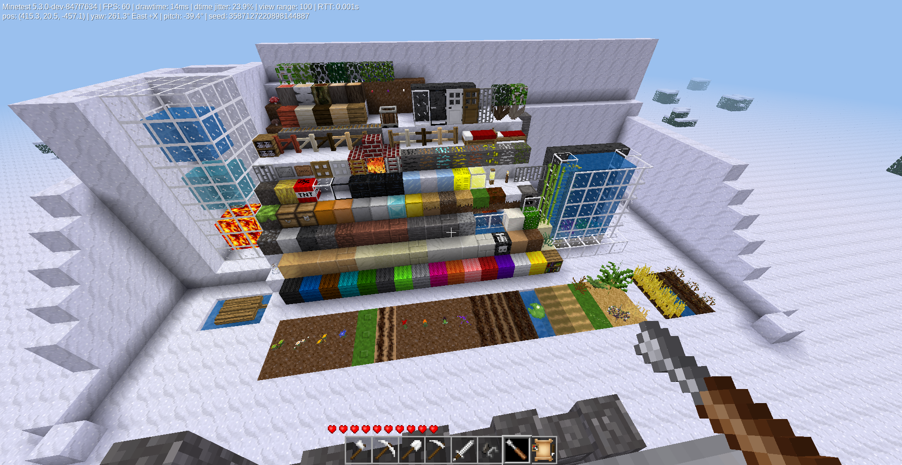

# Simple-Texture-Pack-Test-Map
----

A simple texture-pack test map for Minetest Game.
Current version supports Minetest 5.3-dev, and the associated new items as of the following date.

Extra notes:
Added a worldmod to safely display a few problematic nodes that caused issues due to ABMs.
Nodes changed for display:
```
"flowers:mushroom_red", "tame_nodes:mushroom_red"
"flowers:mushroom_brown", "tame_nodes:mushroom_brown"
"fire:permanent_flame", "tame_nodes:flame"
"fire:basic_flame", "tame_nodes:flame"
"farming:soil", "tame_nodes:soil"
"farming:dry_soil", "tame_nodes:dry_soil"
"farming:desert_sand_soil", "tame_nodes:desert_sand_soil"
```


Current Date:
May 16th, 2020

----
Image preview using Minetest's default textures.

Preview:

